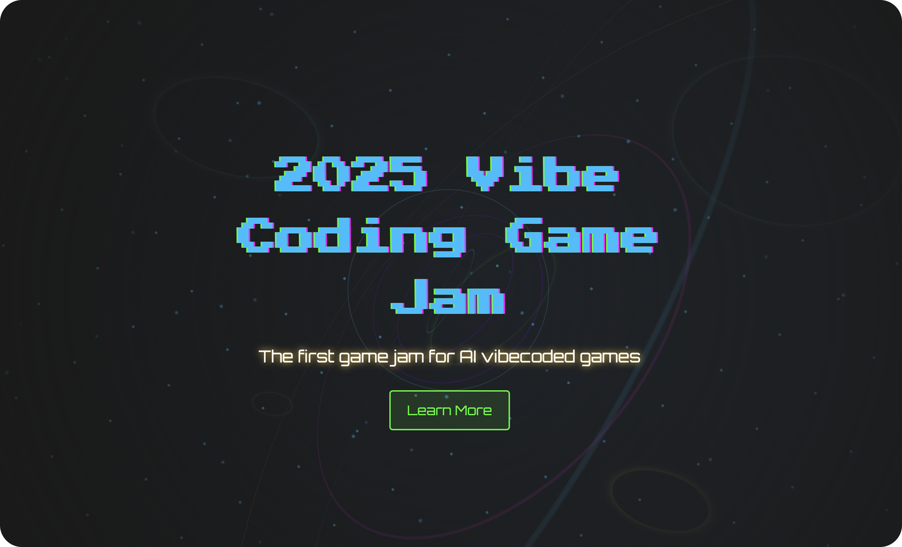

# 2025 Vibe Coding Game Jam Landing Page

This is my landing page for the 2025 Vibe Coding Game Jam, hosted by [@levelsio](https://x.com/levelsio). I’m aiming for the $5K prize for the best website. It’s a hub for the jam, where devs build web games with 80%+ AI-generated code.

Check the page here: [2025 Vibe Coding Game Jam](https://bernaferrari.github.io/vibejam2025/)

## About the Project

I built this page to showcase the 2025 Vibe Coding Game Jam, a challenge to create web-accessible games using mostly AI-written code. It includes event details, judges, sponsors, and a submission link, all styled with a cyberpunk look—neon colors and 3D effects. It’s made with vanilla HTML, CSS, and JavaScript (no Tailwind or React), and I kept it under 250KB for fast loading, as required.

## Features

- Cyberpunk style.
- Interactive particles that react to mouse/touch; say "vibe" or "jam" for effects (mic needed).
- 3D tunnel and spiral animations for a futuristic feel.
- Countdown timer to the deadline.
- Responsive on all devices with accessible design (keyboard nav, high contrast).
- Lightweight at <250KB, with lazy-loaded sections.
- No React, Tailwind, or other frameworks — just vanilla HTML, CSS, and JS.
